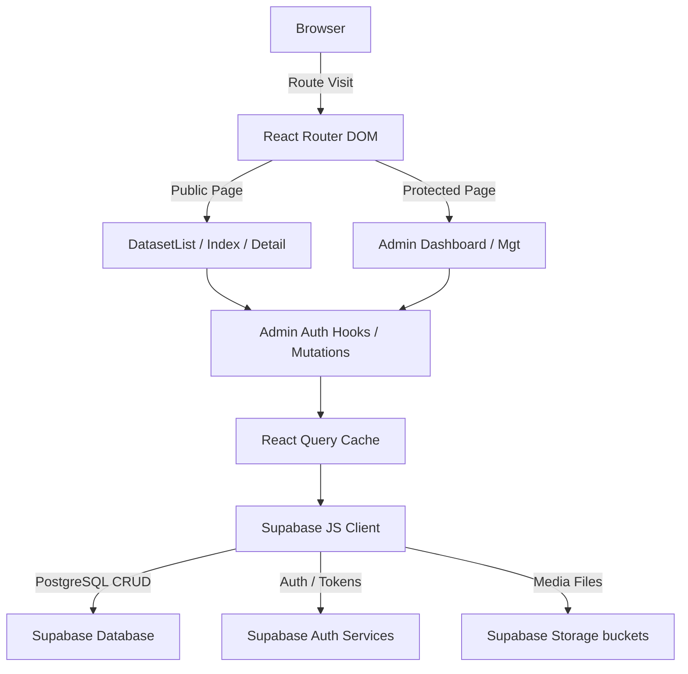

# OpenData Kobar - Project Overview

## 1. State of the Project
Currently, the application is a frontend-heavy open data portal (using React, Vite, Tailwind CSS, shadcn-ui) that integrates tightly with a Supabase backend for persistent storage, authentication, and file hosting.

**What is working:**
- **Navigation & Routing:** Configured with React Router DOM handling public paths (`/`, `/dataset-list`, `/dataset/:slug`) and protected administrative paths (`/admin/*`).
- **Database Integration:** Connects seamlessly to Supabase, pulling metadata, classifications, catalogs, and timeseries data directly from several PostgreSQL tables.
- **Core Admin Features:** Scaffolded for extensive data and taxonomy management (datasets, users, resources, themes, distributions, organizations, tags, classifications).
- **Hooks & Cache State:** Well-implemented custom hooks relying on `@tanstack/react-query` to interact with Supabase (e.g., `useDatasets`, `useDatasetDetail`, `useRoleAccess`, `useDataPoints`).

**What needs to be done / fixed:**
- **Proper View/Download Tracking:** In public-facing views (like `src/pages/DatasetList.tsx`), dataset views and downloads are currently mocked (e.g., `Math.floor(Math.random() * 1000)`). A real analytics/logging table should be correctly incremented during interactions via API/RPC.
- **Pagination Strategy:** For large data tables and dataset lists, pagination or server-side filtering needs to be fully implemented. Currently, there is a reliance on heavy client-side filtering.
- **Admin Verification:** Ensure that all scaffolded CRUD forms in the `/admin` routes push and pull entity dependencies properly to their respective Supabase linked tables, enforcing referential integrity.
- **Telemetry and Audit Logging:** Make sure the underlying `/admin/audit` and analytics dashboards actually receive hook data from timeseries metadata views on download actions.

---

## 2. Database Schema (Based on Code & Supabase Types)

The database (Supabase/PostgreSQL) fundamentally separates the metadata catalog from the granular timeseries records.

### Core Catalog Metadata
- **`catalog_metadata`**: Master table for datasets. Contains fields for title, slug, abstract, maintaining org info, spatial/temporal coverage, and publisher identity.
- **`catalog_resources`**: Represents a structural asset (a file, API, or chart metric) associated with a dataset. Tracks whether an asset is a timeseries metric, its chart type, and unit indicators.
- **`catalog_distributions`**: The actual files (storage URIs, byte sizes, sha256 checksums, and formats) tied to specific resources.
- **`catalog_tags` & `catalog_themes`**: Taxonomies attached to metadata through many-to-many bridge tables (`catalog_dataset_tags`, `catalog_dataset_themes`).

### Timeseries / Measurement Data
- **`data_indicators`**: A measurable variable within a dataset (e.g., "Population Count", "Total Regional Revenue").
- **`data_points`**: Extremely granular records of timeseries data. Contains indicator references, precise time granularity (yearly, monthly), sub-headers, and scalar physical numeric `value`s.
- **`data_table_view_columns`**: Presentation layer mappings for rendering `data_points` correctly inside grids and visualizations.

### Administration & Governance
- **`org_organizations`**: Hierarchical organization structuring (managing agencies, internal government departments).
- **`org_roles` & `org_user_roles`**: RBAC (Role-Based Access Control) managing user authorization context within the system.
- **`gov_dataset_policies`**: Usage constraints and rules for accessing/modifying particular datasets.
- **`api_keys`**: Extensibility for issuing tokens and managing programmatic API access securely for 3rd-party consumers.
- **Taxonomy Tables:** References such as `lisensi` (Licenses), `freq_upd` (Update Frequencies), and `catalog_data_classifications` (Data Sensitivities).

---

## 3. Work/Data Flow Schema

### A. General Application Flow
The application architecture relies heavily on custom React hooks bridging queries between components and Supabase, bypassing the need for a standalone Node/Express server tier.

### B. User Request Flow (Example: Viewing a Dataset)
1. **User requests `/dataset/:slug`**
2. **`DatasetDetail.tsx`** component mounts and extracts the slug parameters.
3. Component calls the **`useDatasetDetail(slug)`** hook.
4. The hook queries `@tanstack/react-query` to fetch from `catalog_metadata` joined iteratively with tags, themes, and distributions in Supabase.
5. If the resource is mapped for timeseries charting (**`is_timeseries: true`**), the component additionally triggers **`useDataPoints`** or **`useDatasetTableData`** to fetch deeper measurement data.
6. The compiled data states flow back into charting libraries (`recharts`) and Shadcn-UI data tables for ultimate display.

### C. Admin Action Flow (Example: Publishing a Dataset)
1. Authorized Admin user securely navigates to `/admin/datasets/add`.
2. Supabase establishes a valid session enforcing PostgreSQL RLS (Row Level Security) confirming the mutation is allowed.
3. The Admin fills out `react-hook-form` controlled fields and finalizes details.
4. If a file asset is uploaded, it pushes straight from browser to **Supabase Storage**, generating a secure internal storage URI pointing to the distribution.
5. A multi-phase `INSERT` executes to establish the `catalog_metadata`, links the mapping references `catalog_resources`, and registers the `catalog_distributions` tied to the URI.
