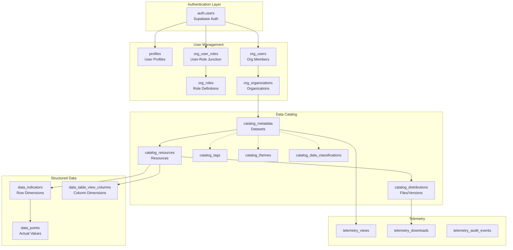
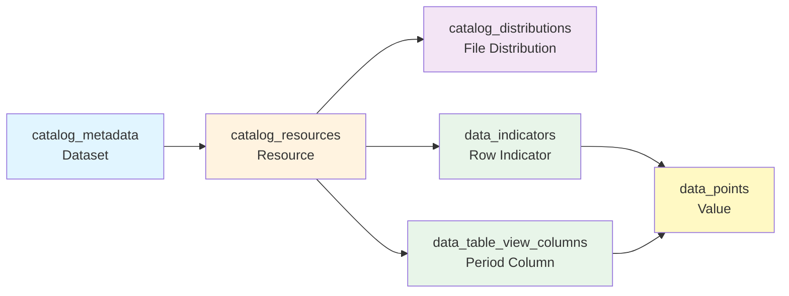

# 📊 Database Schema Documentation

## 🏗️ Open Data Platform - Complete Database Reference

> **Version**: 2.0  
> **Last Updated**: 2024  
> **Architecture**: Multi-tenant, Role-based Access Control (RBAC)  
> **Security**: Row-Level Security (RLS) on all tables

---

## 📑 Table of Contents

1. [Overview](#overview)
2. [Architecture Principles](#architecture-principles)
3. [Entity Relationship Diagrams](#entity-relationship-diagrams)
4. [Core Data Tables](#core-data-tables)
5. [Reference & Lookup Tables](#reference--lookup-tables)
6. [Organization & User Management](#organization--user-management)
7. [Telemetry & Analytics](#telemetry--analytics)
8. [Custom Types (Enums)](#custom-types-enums)
9. [Database Functions](#database-functions)
10. [Security Model](#security-model)
11. [Query Examples](#query-examples)
12. [Best Practices](#best-practices)
13. [Migration Guide](#migration-guide)
14. [Troubleshooting](#troubleshooting)

---

## 📖 Overview

The **Open Data Platform** database implements a comprehensive **data catalog system** with:

- 🔐 **Multi-tenant architecture** with organization-level isolation
- 👥 **Five-tier role hierarchy** (ADMIN, WALIDATA, KOORDINATOR, PRODUSEN, VIEWER)
- 📦 **Dataset lifecycle management** (DRAFT → PENDING_REVIEW → PUBLISHED)
- 🛡️ **Row-Level Security** on all tables
- 📊 **Structured data storage** with indicators and time-series support
- 📁 **File distribution tracking** with version control
- 📈 **Analytics and audit logging**

---

## 🎯 Architecture Principles

### 1. **Security First**
- ✅ All tables protected by RLS policies
- ✅ Roles stored separately in `org_user_roles` (never in user tables)
- ✅ SECURITY DEFINER functions prevent RLS recursion
- ✅ Soft deletes preserve audit trails

### 2. **Multi-Tenancy**
- Organizations have hierarchical relationships (`parent_id`)
- Users belong to organizations via `org_users.org_id`
- Datasets are owned by organizations via `catalog_metadata.publisher_org_id`

### 3. **Flexible Data Model**
- Structured data via indicators × periods matrix
- File-based distributions for any format
- API and web resource types for external data

### 4. **Audit & Compliance**
- All significant actions logged in `telemetry_audit_events`
- Downloads tracked in `telemetry_downloads`
- Views tracked in `telemetry_views`
- Timestamps on all mutable tables (`created_at`, `updated_at`)

---

## 🗺️ Entity Relationship Diagrams

### High-Level System Architecture



### Dataset Relationship Flow



---

## 📦 Core Data Tables

### 1. `catalog_metadata` - Datasets

**Purpose**: Central registry for all datasets in the platform.

#### 📋 Schema

| Column | Type | Constraints | Description |
|--------|------|-------------|-------------|
| `id` | UUID | PRIMARY KEY | Unique dataset identifier |
| `title` | VARCHAR | NOT NULL | Dataset display title |
| `slug` | VARCHAR | NOT NULL, UNIQUE | URL-friendly identifier |
| `description` | TEXT | NULLABLE | Short description (~200 chars) |
| `abstract` | TEXT | NULLABLE | Detailed description/methodology |
| `source_name` | VARCHAR | NULLABLE | Data source organization |
| `contact_email` | VARCHAR | NULLABLE | Maintainer contact email |
| `language` | VARCHAR | DEFAULT 'id' | ISO 639-1 language code |
| `classification_code` | ENUM | DEFAULT 'PUBLIC' | PUBLIC, INTERNAL, CONFIDENTIAL |
| `publication_status` | ENUM | DEFAULT 'DRAFT' | DRAFT, PENDING_REVIEW, PUBLISHED |
| `publisher_org_id` | UUID | FK → org_organizations | Publishing organization |
| `license_code` | VARCHAR | FK → lisensi | Data license (e.g., CC-BY-4.0) |
| `update_frequency_code` | VARCHAR | FK → freq_upd | Update frequency (DAILY, MONTHLY, etc.) |
| `temporal_start` | DATE | NULLABLE | Coverage start date |
| `temporal_end` | DATE | NULLABLE | Coverage end date |
| `keywords` | JSONB | DEFAULT '[]' | Array of keyword strings |
| `maintainers` | JSONB | DEFAULT '[]' | Array of maintainer strings |
| `custom_fields` | JSONB | DEFAULT '{}' | Extensible metadata |
| `created_by` | UUID | FK → auth.users | Creator user ID |
| `updated_by` | UUID | FK → auth.users | Last modifier user ID |
| `created_at` | TIMESTAMPTZ | NOT NULL | Creation timestamp |
| `updated_at` | TIMESTAMPTZ | NOT NULL | Last update timestamp |
| `last_updated_display` | TIMESTAMPTZ | NULLABLE | Display date for data freshness |
| `deleted_at` | TIMESTAMPTZ | NULLABLE | Soft delete timestamp |

#### 🔒 RLS Policies

| Policy | Command | Condition |
|--------|---------|-----------|
| **Dataset viewing** | SELECT | Public: `publication_status = 'PUBLISHED' AND classification_code = 'PUBLIC'`<br/>OR authenticated: has_role('ADMIN/WALIDATA/KOORDINATOR') OR same org |
| **Dataset creation** | INSERT | Authenticated AND (ADMIN OR WALIDATA OR PRODUSEN in same org) |
| **Dataset update** | UPDATE | Authenticated AND (ADMIN OR WALIDATA OR PRODUSEN in same org) AND status IN ('DRAFT', 'PENDING_REVIEW') |
| **Dataset deletion** | DELETE | Same as update |

#### 📌 Indexes

```sql
CREATE INDEX idx_catalog_metadata_slug ON catalog_metadata(slug);
CREATE INDEX idx_catalog_metadata_publisher_org ON catalog_metadata(publisher_org_id);
CREATE INDEX idx_catalog_metadata_publication_status ON catalog_metadata(publication_status);
CREATE INDEX idx_catalog_metadata_deleted_at ON catalog_metadata(deleted_at) WHERE deleted_at IS NULL;
```

#### 💡 Usage Example

```typescript
// Create a new dataset
const { data: dataset, error } = await supabase
  .from('catalog_metadata')
  .insert({
    title: 'Population Statistics 2024',
    slug: 'population-stats-2024',
    description: 'Annual population data by region',
    publisher_org_id: orgId,
    classification_code: 'PUBLIC',
    publication_status: 'DRAFT',
    license_code: 'CC-BY-4.0',
    update_frequency_code: 'ANNUALLY',
    temporal_start: '2024-01-01',
    temporal_end: '2024-12-31',
    keywords: ['population', 'demographics', 'statistics'],
    maintainers: ['data-team@example.com']
  })
  .select()
  .single();

// Query published datasets
const { data: datasets } = await supabase
  .from('catalog_metadata')
  .select(`
    *,
    publisher_org:org_organizations(name, short_name),
    resources:catalog_resources(count)
  `)
  .eq('publication_status', 'PUBLISHED')
  .is('deleted_at', null)
  .order('created_at', { ascending: false });
```

---

### 2. `catalog_resources` - Dataset Resources

**Purpose**: Resources attached to datasets (tables, files, APIs, web links).

#### 📋 Schema

| Column | Type | Constraints | Description |
|--------|------|-------------|-------------|
| `id` | UUID | PRIMARY KEY | Unique resource identifier |
| `dataset_id` | UUID | NOT NULL, FK → catalog_metadata | Parent dataset |
| `name` | VARCHAR | NOT NULL | Resource display name |
| `description` | TEXT | NULLABLE | Resource description |
| `resource_type` | ENUM | NOT NULL | TABLE, FILE, API, WEB |
| `schema_json` | JSONB | DEFAULT '{}' | Schema definition for TABLE type |
| `created_at` | TIMESTAMPTZ | NOT NULL | Creation timestamp |
| `updated_at` | TIMESTAMPTZ | NOT NULL | Last update timestamp |

#### 🔒 RLS Policies

Inherits policies from parent `catalog_metadata` (checks dataset permissions).

#### 💡 Usage Example

```typescript
// Add a TABLE resource to a dataset
const { data: resource } = await supabase
  .from('catalog_resources')
  .insert({
    dataset_id: datasetId,
    name: 'Population by Age Group',
    description: 'Annual population counts disaggregated by age',
    resource_type: 'TABLE',
    schema_json: {
      columns: [
        { name: 'age_group', type: 'string' },
        { name: 'count', type: 'integer' },
        { name: 'year', type: 'integer' }
      ]
    }
  })
  .select()
  .single();

// Add a FILE resource
const { data: fileResource } = await supabase
  .from('catalog_resources')
  .insert({
    dataset_id: datasetId,
    name: 'Full Dataset (CSV)',
    description: 'Complete dataset in CSV format',
    resource_type: 'FILE'
  })
  .select()
  .single();
```

---

### 3. `catalog_distributions` - File Distributions

**Purpose**: Physical file distributions with versioning and checksums.

#### 📋 Schema

| Column | Type | Constraints | Description |
|--------|------|-------------|-------------|
| `id` | UUID | PRIMARY KEY | Unique distribution identifier |
| `resource_id` | UUID | NOT NULL, FK → catalog_resources | Parent resource |
| `version` | VARCHAR | NOT NULL | Version string (e.g., "1.0", "2024-01") |
| `media_type` | VARCHAR | NOT NULL | MIME type (e.g., "text/csv") |
| `storage_uri` | VARCHAR | NULLABLE | Storage path or URL |
| `byte_size` | BIGINT | NULLABLE | File size in bytes |
| `checksum_sha256` | CHAR(64) | NULLABLE | SHA-256 checksum for integrity |
| `availability` | ENUM | DEFAULT 'online' | online, offline, archived |
| `created_at` | TIMESTAMPTZ | NOT NULL | Creation timestamp |

#### 🔒 RLS Policies

Inherits policies from parent resource/dataset.

#### 💡 Usage Example

```typescript
// Add a file distribution
const { data: distribution } = await supabase
  .from('catalog_distributions')
  .insert({
    resource_id: resourceId,
    version: '2024.1',
    media_type: 'text/csv',
    storage_uri: 'datasets/population-2024.csv',
    byte_size: 15728640, // 15 MB
    checksum_sha256: 'a3f5...',
    availability: 'online'
  })
  .select()
  .single();

// Track download
await supabase.from('telemetry_downloads').insert({
  distribution_id: distribution.id,
  user_id: userId,
  channel: 'WEB',
  client_info: {
    user_agent: navigator.userAgent,
    referrer: document.referrer
  }
});
```

---

### 4. `data_indicators` - Row Dimensions

**Purpose**: Row indicators for structured data tables (e.g., "Total Population", "GDP", "Unemployment Rate").

#### 📋 Schema

| Column | Type | Constraints | Description |
|--------|------|-------------|-------------|
| `id` | UUID | PRIMARY KEY | Unique indicator identifier |
| `resource_id` | UUID | NOT NULL, FK → catalog_resources | Parent resource (must be TABLE type) |
| `code` | VARCHAR | NOT NULL | Indicator code (e.g., "POP_TOTAL") |
| `label` | VARCHAR | NOT NULL | Display label |
| `description` | TEXT | NULLABLE | Indicator definition |
| `unit` | VARCHAR | NULLABLE | Unit of measurement (e.g., "persons", "%") |
| `order_no` | INTEGER | DEFAULT 0 | Display order |
| `is_active` | BOOLEAN | DEFAULT true | Active/archived flag |
| `created_at` | TIMESTAMPTZ | NOT NULL | Creation timestamp |
| `updated_at` | TIMESTAMPTZ | NOT NULL | Last update timestamp |

#### 🔒 RLS Policies

Inherits policies from parent resource/dataset.

#### 💡 Usage Example

```typescript
// Create indicators for a population table
const indicators = [
  {
    resource_id: resourceId,
    code: 'POP_TOTAL',
    label: 'Total Population',
    description: 'Total resident population',
    unit: 'persons',
    order_no: 1
  },
  {
    resource_id: resourceId,
    code: 'POP_MALE',
    label: 'Male Population',
    unit: 'persons',
    order_no: 2
  },
  {
    resource_id: resourceId,
    code: 'POP_FEMALE',
    label: 'Female Population',
    unit: 'persons',
    order_no: 3
  }
];

const { data } = await supabase
  .from('data_indicators')
  .insert(indicators)
  .select();
```

---

### 5. `data_table_view_columns` - Period Columns

**Purpose**: Column dimensions for time-series data (years, quarters, months, etc.).

#### 📋 Schema

| Column | Type | Constraints | Description |
|--------|------|-------------|-------------|
| `id` | UUID | PRIMARY KEY | Unique column identifier |
| `resource_id` | UUID | NOT NULL, FK → catalog_resources | Parent resource |
| `time_grain` | ENUM | NOT NULL | YEAR, QUARTER, MONTH, WEEK, DAY |
| `period_start` | DATE | NOT NULL | Period start date |
| `column_label` | VARCHAR | NOT NULL | Display label (e.g., "2024", "Q1 2024") |
| `column_order` | INTEGER | DEFAULT 0 | Display order |
| `is_hidden` | BOOLEAN | DEFAULT false | Hidden column flag |
| `created_at` | TIMESTAMPTZ | NOT NULL | Creation timestamp |
| `updated_at` | TIMESTAMPTZ | NOT NULL | Last update timestamp |

#### 🔑 Unique Constraint

```sql
UNIQUE (resource_id, time_grain, period_start)
```

#### 💡 Usage Example

```typescript
// Create yearly columns for 2020-2024
const years = [2020, 2021, 2022, 2023, 2024];
const columns = years.map((year, index) => ({
  resource_id: resourceId,
  time_grain: 'YEAR',
  period_start: `${year}-01-01`,
  column_label: year.toString(),
  column_order: index
}));

await supabase
  .from('data_table_view_columns')
  .insert(columns);
```

---

### 6. `data_points` - Actual Data Values

**Purpose**: Stores actual data values at the intersection of indicators and periods.

#### 📋 Schema

| Column | Type | Constraints | Description |
|--------|------|-------------|-------------|
| `id` | UUID | PRIMARY KEY | Unique data point identifier |
| `indicator_id` | UUID | NOT NULL, FK → data_indicators | Row indicator |
| `resource_id` | UUID | NOT NULL, FK → catalog_resources | Parent resource |
| `time_grain` | ENUM | NOT NULL | Time granularity |
| `period_start` | DATE | NOT NULL | Period start date |
| `period_label` | VARCHAR | NOT NULL | Display label |
| `value` | NUMERIC | NULLABLE | Actual numeric value |
| `qualifier` | ENUM | DEFAULT 'OFFICIAL' | OFFICIAL, PRELIMINARY, ESTIMATED, REVISED, NA |
| `distribution_id` | UUID | NULLABLE, FK → catalog_distributions | Source distribution |
| `distribution_key` | TEXT | NULLABLE | Source file key/path |
| `top_header_value` | TEXT | NULLABLE | Hierarchical header level 1 |
| `sub_header_value` | TEXT | NULLABLE | Hierarchical header level 2 |
| `row_dimension_value` | TEXT | NULLABLE | Additional row dimension |
| `attrs` | JSONB | DEFAULT '{}' | Additional attributes |
| `created_at` | TIMESTAMPTZ | NOT NULL | Creation timestamp |
| `updated_at` | TIMESTAMPTZ | NOT NULL | Last update timestamp |

#### 🔑 Unique Constraint

```sql
UNIQUE (indicator_id, resource_id, period_start)
```

#### 💡 Usage Example

```typescript
// Upsert data points (prevents duplicates)
const dataPoints = [
  {
    indicator_id: indicatorIds.POP_TOTAL,
    resource_id: resourceId,
    time_grain: 'YEAR',
    period_start: '2024-01-01',
    period_label: '2024',
    value: 275000000,
    qualifier: 'OFFICIAL'
  },
  {
    indicator_id: indicatorIds.POP_MALE,
    resource_id: resourceId,
    time_grain: 'YEAR',
    period_start: '2024-01-01',
    period_label: '2024',
    value: 137500000,
    qualifier: 'OFFICIAL'
  }
];

// Use upsert to handle duplicates
const { data } = await supabase
  .from('data_points')
  .upsert(dataPoints, {
    onConflict: 'indicator_id,resource_id,period_start'
  });
```

---

## 📚 Reference & Lookup Tables

### `catalog_tags`

**Purpose**: Tagging system for datasets.

| Column | Type | Description |
|--------|------|-------------|
| `id` | UUID | Primary key |
| `name` | VARCHAR | Tag name (unique) |

**Junction Table**: `catalog_dataset_tags` (dataset_id, tag_id)

**RLS**: Public read, authenticated write

---

### `catalog_themes`

**Purpose**: Thematic categories for datasets.

| Column | Type | Description |
|--------|------|-------------|
| `id` | UUID | Primary key |
| `code` | VARCHAR | Theme code (unique) |
| `name` | VARCHAR | Theme display name |
| `icon_url` | TEXT | Theme icon URL |

**Junction Table**: `catalog_dataset_themes` (dataset_id, theme_id)

**RLS**: Public read, authenticated write

---

### `catalog_data_classifications`

**Purpose**: Data sensitivity levels.

| Code | Name | Notes |
|------|------|-------|
| `PUBLIC` | Public Data | Freely accessible |
| `INTERNAL` | Internal Data | Organization-only |
| `CONFIDENTIAL` | Confidential | Restricted access |

**RLS**: Public read only

---

### `lisensi` (Licenses)

**Purpose**: Data licenses (e.g., Creative Commons).

| Column | Type | Description |
|--------|------|-------------|
| `code` | VARCHAR | License code (e.g., "CC-BY-4.0") |
| `name` | VARCHAR | License full name |
| `url` | VARCHAR | License URL |
| `notes` | TEXT | Additional notes |

**RLS**: Public read only

---

### `freq_upd` (Update Frequencies)

**Purpose**: Dataset update schedules.

| Code | Name |
|------|------|
| `DAILY` | Daily |
| `WEEKLY` | Weekly |
| `MONTHLY` | Monthly |
| `QUARTERLY` | Quarterly |
| `ANNUALLY` | Annually |

**RLS**: Public read only

---

## 👥 Organization & User Management

### `org_organizations`

**Purpose**: Organizational entities (hierarchical).

#### 📋 Schema

| Column | Type | Description |
|--------|------|-------------|
| `id` | UUID | Primary key |
| `name` | VARCHAR | Organization full name |
| `short_name` | VARCHAR | Abbreviation |
| `org_type` | ENUM | GOVERNMENT, NGO, PRIVATE, ACADEMIC, INTERNATIONAL |
| `parent_id` | UUID | Parent organization (for hierarchy) |
| `metadata` | JSONB | Additional metadata |
| `created_at` | TIMESTAMPTZ | Creation timestamp |
| `updated_at` | TIMESTAMPTZ | Last update timestamp |

**RLS**: Authenticated users can view, ADMIN can manage

---

### `org_roles`

**Purpose**: Role definitions.

#### 📋 Schema

| Column | Type | Description |
|--------|------|-------------|
| `id` | UUID | Primary key |
| `code` | VARCHAR | Role code (ADMIN, WALIDATA, etc.) |
| `name` | VARCHAR | Role display name |
| `created_at` | TIMESTAMPTZ | Creation timestamp |

#### 🎭 Role Hierarchy

| Role | Code | Permissions |
|------|------|-------------|
| **Administrator** | `ADMIN` | Full system access, user management, all operations |
| **Data Guardian** | `WALIDATA` | Approve/publish datasets, manage organizations, assign VIEWER/PRODUSEN roles |
| **Coordinator** | `KOORDINATOR` | View all datasets in organization (read-only) |
| **Producer** | `PRODUSEN` | Create/edit datasets in own org (DRAFT/PENDING_REVIEW only) |
| **Viewer** | `VIEWER` | Read-only access to internal datasets |

**RLS**: Public read only

---

### `org_user_roles` ⚠️ **CRITICAL SECURITY TABLE**

**Purpose**: Junction table linking users to roles (many-to-many).

#### 📋 Schema

| Column | Type | Description |
|--------|------|-------------|
| `user_id` | UUID | FK → auth.users |
| `role_id` | UUID | FK → org_roles |

**Primary Key**: `(user_id, role_id)`

#### 🔒 RLS Policies

| Policy | Command | Condition |
|--------|---------|-----------|
| View user roles | SELECT | Authenticated users |
| Manage roles | INSERT/UPDATE/DELETE | ADMIN (all roles) OR WALIDATA (VIEWER/PRODUSEN only) |

#### 🚨 SECURITY WARNING

**NEVER** store roles in the `profiles` or `org_users` table!

```typescript
// ❌ WRONG - Privilege escalation vulnerability
await supabase.from('profiles').update({ role: 'admin' });
// Users can update their own profile → instant admin access!

// ✅ CORRECT - Separate table with strict RLS
await supabase.from('org_user_roles').insert({
  user_id: targetUserId,
  role_id: adminRoleId
});
// RLS prevents self-assignment
```

---

### `profiles`

**Purpose**: User profile information (extends auth.users).

#### 📋 Schema

| Column | Type | Description |
|--------|------|-------------|
| `id` | UUID | PRIMARY KEY → auth.users(id) |
| `email` | VARCHAR | User email (synced from auth) |
| `full_name` | VARCHAR | Display name |
| `created_at` | TIMESTAMPTZ | Creation timestamp |
| `updated_at` | TIMESTAMPTZ | Last update timestamp |

#### 🔒 RLS Policies

- Users can view/update their own profile
- ADMINs can view/update all profiles

#### ⚠️ REMOVED COLUMNS

- ~~`role`~~ - **REMOVED** (privilege escalation risk)
- Roles MUST be stored in `org_user_roles` only

---

### `org_users`

**Purpose**: Organizational user records (alternative user table).

#### 📋 Schema

| Column | Type | Description |
|--------|------|-------------|
| `id` | UUID | Primary key |
| `email` | VARCHAR | User email (unique) |
| `full_name` | VARCHAR | Full name |
| `org_id` | UUID | FK → org_organizations |
| `is_active` | BOOLEAN | Active/inactive flag |
| `attributes` | JSONB | Additional attributes |
| `created_at` | TIMESTAMPTZ | Creation timestamp |
| `updated_at` | TIMESTAMPTZ | Last update timestamp |

#### 🔒 RLS Policies

ADMIN only (all operations)

#### ⚠️ REMOVED COLUMNS

- ~~`password_hash`~~ - **REMOVED** (credential exposure risk)
- Use Supabase Auth (`auth.users`) for authentication

---

## 📊 Telemetry & Analytics

### `telemetry_views`

**Purpose**: Track dataset page views.

| Column | Type | Description |
|--------|------|-------------|
| `id` | BIGSERIAL | Primary key |
| `dataset_id` | UUID | FK → catalog_metadata |
| `user_id` | UUID | FK → auth.users (nullable for anonymous) |
| `session_id` | VARCHAR | Session identifier |
| `ip_address` | INET | Client IP address |
| `user_agent` | TEXT | Browser user agent |
| `referrer` | TEXT | Referrer URL |
| `created_at` | TIMESTAMPTZ | View timestamp |

**RLS**: Public insert, users view own records

---

### `telemetry_downloads`

**Purpose**: Track file downloads.

| Column | Type | Description |
|--------|------|-------------|
| `id` | BIGSERIAL | Primary key |
| `distribution_id` | UUID | FK → catalog_distributions |
| `user_id` | UUID | FK → auth.users (nullable) |
| `channel` | ENUM | WEB, API, DIRECT |
| `client_info` | JSONB | User agent, IP, etc. |
| `created_at` | TIMESTAMPTZ | Download timestamp |

**RLS**: Authenticated insert/view

---

### `telemetry_audit_events`

**Purpose**: Audit trail for significant actions.

| Column | Type | Description |
|--------|------|-------------|
| `id` | BIGSERIAL | Primary key |
| `actor_id` | UUID | FK → auth.users |
| `action` | VARCHAR | Action type (CREATE, UPDATE, DELETE, PUBLISH, etc.) |
| `object_type` | VARCHAR | Object type (dataset, resource, user, etc.) |
| `object_id` | UUID | Target object ID |
| `context` | JSONB | Before/after state, reason, metadata |
| `created_at` | TIMESTAMPTZ | Event timestamp |

**RLS**: Authenticated insert/view

---

## 🎨 Custom Types (Enums)

### `publication_status`

```sql
CREATE TYPE publication_status AS ENUM (
  'DRAFT',           -- Initial state, editable
  'PENDING_REVIEW',  -- Submitted for review
  'PUBLISHED'        -- Public, read-only
);
```

---

### `classification_type`

```sql
CREATE TYPE classification_type AS ENUM (
  'PUBLIC',          -- Publicly accessible
  'INTERNAL',        -- Organization-only
  'CONFIDENTIAL'     -- Restricted access
);
```

---

### `resource_type`

```sql
CREATE TYPE resource_type AS ENUM (
  'TABLE',   -- Structured data table
  'FILE',    -- Downloadable file
  'API',     -- API endpoint
  'WEB'      -- Web link
);
```

---

### `time_grain`

```sql
CREATE TYPE time_grain AS ENUM (
  'YEAR',
  'QUARTER',
  'MONTH',
  'WEEK',
  'DAY'
);
```

---

### `qualifier_type`

```sql
CREATE TYPE qualifier_type AS ENUM (
  'OFFICIAL',      -- Final, official data
  'PRELIMINARY',   -- Initial estimate
  'ESTIMATED',     -- Calculated estimate
  'REVISED',       -- Revised from previous
  'NA'            -- Not available
);
```

---

### `availability_type`

```sql
CREATE TYPE availability_type AS ENUM (
  'online',    -- Currently available
  'offline',   -- Temporarily unavailable
  'archived'   -- Permanently archived
);
```

---

### `download_channel`

```sql
CREATE TYPE download_channel AS ENUM (
  'WEB',     -- Web interface
  'API',     -- API call
  'DIRECT'   -- Direct link
);
```

---

### `org_type`

```sql
CREATE TYPE org_type AS ENUM (
  'GOVERNMENT',
  'NGO',
  'PRIVATE',
  'ACADEMIC',
  'INTERNATIONAL'
);
```

---

## ⚙️ Database Functions

### `has_role(_role_code TEXT) → BOOLEAN`

**Purpose**: Check if current user has a specific role.

```sql
CREATE FUNCTION public.has_role(_role text)
RETURNS boolean
LANGUAGE sql
STABLE
SECURITY DEFINER
SET search_path = public
AS $$
  SELECT EXISTS (
    SELECT 1
    FROM org_user_roles ur
    JOIN org_roles r ON ur.role_id = r.id
    WHERE ur.user_id = auth.uid()
    AND r.code = _role
  );
$$;
```

**Usage**:
```sql
SELECT has_role('ADMIN');  -- Returns true/false
```

---

### `is_admin(_user_id UUID DEFAULT auth.uid()) → BOOLEAN`

**Purpose**: Check if user is an admin.

```sql
CREATE FUNCTION public.is_admin(_user_id uuid DEFAULT auth.uid())
RETURNS boolean
LANGUAGE sql
STABLE
SECURITY DEFINER
SET search_path = public
AS $$
  SELECT has_role('ADMIN');
$$;
```

**Usage**:
```sql
SELECT is_admin();  -- Current user
SELECT is_admin('some-uuid');  -- Specific user
```

---

### `auth_org_id() → UUID`

**Purpose**: Get current user's organization ID.

```sql
CREATE FUNCTION public.auth_org_id()
RETURNS uuid
LANGUAGE sql
STABLE
SECURITY DEFINER
SET search_path = public
AS $$
  SELECT org_id
  FROM org_users
  WHERE id = auth.uid();
$$;
```

**Usage**:
```sql
SELECT auth_org_id();
```

---

### `get_user_org_id() → UUID`

**Purpose**: Alias for `auth_org_id()`.

```sql
CREATE FUNCTION public.get_user_org_id()
RETURNS uuid
LANGUAGE sql
STABLE
SECURITY DEFINER
SET search_path = public
AS $$
  SELECT org_id FROM public.org_users WHERE id = auth.uid();
$$;
```

---

### `handle_new_user()` - Trigger Function

**Purpose**: Auto-create profile and assign default role on user signup.

```sql
CREATE FUNCTION public.handle_new_user()
RETURNS trigger
LANGUAGE plpgsql
SECURITY DEFINER
SET search_path = public
AS $$
DECLARE
  viewer_role_id UUID;
BEGIN
  -- Create profile WITHOUT role column
  INSERT INTO public.profiles (id, email, full_name)
  VALUES (
    NEW.id,
    NEW.email,
    COALESCE(NEW.raw_user_meta_data->>'full_name', '')
  );
  
  -- Create org_users record WITHOUT password_hash
  INSERT INTO public.org_users (id, email, full_name, org_id, is_active)
  VALUES (
    NEW.id,
    NEW.email,
    COALESCE(NEW.raw_user_meta_data->>'full_name', 'Unknown User'),
    NULL,
    true
  );
  
  -- Assign default VIEWER role via org_user_roles ONLY
  SELECT id INTO viewer_role_id FROM public.org_roles WHERE code = 'VIEWER' LIMIT 1;
  
  IF viewer_role_id IS NOT NULL THEN
    INSERT INTO public.org_user_roles (user_id, role_id) 
    VALUES (NEW.id, viewer_role_id);
  END IF;
  
  RETURN NEW;
END;
$$;

-- Attach trigger
CREATE TRIGGER on_auth_user_created
  AFTER INSERT ON auth.users
  FOR EACH ROW EXECUTE FUNCTION public.handle_new_user();
```

---

### Analytics Functions

#### `get_dataset_view_count(dataset_id UUID) → BIGINT`

```sql
CREATE FUNCTION public.get_dataset_view_count(dataset_id_param uuid)
RETURNS bigint
LANGUAGE sql
SECURITY DEFINER
SET search_path = public
AS $$
  SELECT COUNT(*)
  FROM telemetry_views
  WHERE dataset_id = dataset_id_param;
$$;
```

#### `get_dataset_download_count(dataset_id UUID) → BIGINT`

```sql
CREATE FUNCTION public.get_dataset_download_count(dataset_id_param uuid)
RETURNS bigint
LANGUAGE sql
SECURITY DEFINER
SET search_path = public
AS $$
  SELECT COUNT(*)
  FROM telemetry_downloads td
  JOIN catalog_distributions cd ON td.distribution_id = cd.id
  JOIN catalog_resources cr ON cd.resource_id = cr.id
  WHERE cr.dataset_id = dataset_id_param;
$$;
```

---

## 🔐 Security Model

### RLS Policy Patterns

All tables use **Row-Level Security** with these patterns:

#### 1. **Public Read**
```sql
CREATE POLICY "public_read"
ON table_name
FOR SELECT
USING (true);
```

#### 2. **Own Record Access**
```sql
CREATE POLICY "own_record"
ON profiles
FOR ALL
USING (auth.uid() = id)
WITH CHECK (auth.uid() = id);
```

#### 3. **Role-Based Access**
```sql
CREATE POLICY "admin_all_access"
ON table_name
FOR ALL
USING (has_role('ADMIN'))
WITH CHECK (has_role('ADMIN'));
```

#### 4. **Organization-Based Access**
```sql
CREATE POLICY "same_org_access"
ON catalog_metadata
FOR SELECT
USING (publisher_org_id = auth_org_id());
```

#### 5. **Hierarchical Access**
```sql
CREATE POLICY "dataset_viewing"
ON catalog_metadata
FOR SELECT
USING (
  (publication_status = 'PUBLISHED' AND classification_code = 'PUBLIC')
  OR (auth.uid() IS NOT NULL AND (
    has_role('ADMIN')
    OR has_role('WALIDATA')
    OR has_role('KOORDINATOR')
    OR publisher_org_id = auth_org_id()
  ))
);
```

---

## 📖 Query Examples

### Get User's Roles

```typescript
const { data: userRoles } = await supabase
  .from('org_user_roles')
  .select(`
    role:org_roles(code, name)
  `)
  .eq('user_id', userId);

const roleCodes = userRoles?.map(ur => ur.role.code) || [];
```

---

### Get Datasets with Statistics

```typescript
const { data: datasets } = await supabase
  .from('catalog_metadata')
  .select(`
    *,
    publisher_org:org_organizations(name, short_name),
    resources:catalog_resources(count),
    tags:catalog_dataset_tags(tag:catalog_tags(name)),
    themes:catalog_dataset_themes(theme:catalog_themes(name, icon_url))
  `)
  .eq('publication_status', 'PUBLISHED')
  .is('deleted_at', null);

// Add view/download counts
for (const dataset of datasets) {
  const { data: viewCount } = await supabase
    .rpc('get_dataset_view_count', { dataset_id_param: dataset.id });
  
  const { data: downloadCount } = await supabase
    .rpc('get_dataset_download_count', { dataset_id_param: dataset.id });
  
  dataset.view_count = viewCount || 0;
  dataset.download_count = downloadCount || 0;
}
```

---

### Get Structured Data (Indicators × Periods)

```typescript
// Get indicators
const { data: indicators } = await supabase
  .from('data_indicators')
  .select('*')
  .eq('resource_id', resourceId)
  .eq('is_active', true)
  .order('order_no');

// Get periods
const { data: periods } = await supabase
  .from('data_table_view_columns')
  .select('*')
  .eq('resource_id', resourceId)
  .eq('is_hidden', false)
  .order('column_order');

// Get data points
const { data: dataPoints } = await supabase
  .from('data_points')
  .select('*')
  .eq('resource_id', resourceId);

// Build matrix
const matrix = indicators.map(indicator => ({
  indicator,
  values: periods.map(period => {
    const point = dataPoints.find(
      p => p.indicator_id === indicator.id && 
           p.period_start === period.period_start
    );
    return point?.value || null;
  })
}));
```

---

### Create Dataset Workflow

```typescript
// 1. Create dataset
const { data: dataset } = await supabase
  .from('catalog_metadata')
  .insert({
    title: 'Economic Indicators 2024',
    slug: 'economic-indicators-2024',
    publisher_org_id: orgId,
    classification_code: 'PUBLIC',
    publication_status: 'DRAFT',
    license_code: 'CC-BY-4.0'
  })
  .select()
  .single();

// 2. Add resource
const { data: resource } = await supabase
  .from('catalog_resources')
  .insert({
    dataset_id: dataset.id,
    name: 'Key Economic Metrics',
    resource_type: 'TABLE'
  })
  .select()
  .single();

// 3. Add indicators
const indicators = [
  { code: 'GDP', label: 'GDP Growth', unit: '%' },
  { code: 'INFLATION', label: 'Inflation Rate', unit: '%' },
  { code: 'UNEMPLOYMENT', label: 'Unemployment Rate', unit: '%' }
];

await supabase
  .from('data_indicators')
  .insert(indicators.map((ind, i) => ({
    ...ind,
    resource_id: resource.id,
    order_no: i
  })));

// 4. Add periods
const periods = ['2020', '2021', '2022', '2023', '2024'].map((year, i) => ({
  resource_id: resource.id,
  time_grain: 'YEAR',
  period_start: `${year}-01-01`,
  column_label: year,
  column_order: i
}));

await supabase
  .from('data_table_view_columns')
  .insert(periods);

// 5. Add data points
const dataPoints = [
  { indicator_code: 'GDP', year: '2024', value: 5.2 },
  { indicator_code: 'INFLATION', year: '2024', value: 3.1 },
  { indicator_code: 'UNEMPLOYMENT', year: '2024', value: 5.8 }
];

// Get indicator IDs
const { data: indicatorList } = await supabase
  .from('data_indicators')
  .select('id, code')
  .eq('resource_id', resource.id);

const indicatorMap = Object.fromEntries(
  indicatorList.map(ind => [ind.code, ind.id])
);

await supabase
  .from('data_points')
  .upsert(
    dataPoints.map(dp => ({
      indicator_id: indicatorMap[dp.indicator_code],
      resource_id: resource.id,
      time_grain: 'YEAR',
      period_start: `${dp.year}-01-01`,
      period_label: dp.year,
      value: dp.value,
      qualifier: 'OFFICIAL'
    })),
    { onConflict: 'indicator_id,resource_id,period_start' }
  );
```

---

## ✅ Best Practices

### 1. **Always Use Upsert for Data Points**

```typescript
// ✅ CORRECT - Prevents duplicate key errors
await supabase.from('data_points').upsert(dataPoint, {
  onConflict: 'indicator_id,resource_id,period_start'
});

// ❌ WRONG - May fail on duplicates
await supabase.from('data_points').insert(dataPoint);
```

---

### 2. **Never Store Roles in User Tables**

```typescript
// ❌ WRONG - Privilege escalation vulnerability
await supabase.from('profiles').update({ role: 'admin' });

// ✅ CORRECT - Separate table with RLS
await supabase.from('org_user_roles').insert({
  user_id: userId,
  role_id: adminRoleId
});
```

---

### 3. **Use Soft Deletes**

```typescript
// Soft delete (preserves audit trail)
await supabase
  .from('catalog_metadata')
  .update({ deleted_at: new Date().toISOString() })
  .eq('id', datasetId);

// Query excludes soft-deleted
await supabase
  .from('catalog_metadata')
  .select('*')
  .is('deleted_at', null);
```

---

### 4. **Log Audit Events**

```typescript
await supabase.from('telemetry_audit_events').insert({
  actor_id: userId,
  action: 'PUBLISH',
  object_type: 'dataset',
  object_id: datasetId,
  context: {
    from_status: 'PENDING_REVIEW',
    to_status: 'PUBLISHED',
    reason: 'Approved by data guardian'
  }
});
```

---

### 5. **Validate Before Insert**

```typescript
// Validate slug uniqueness
const { data: existing } = await supabase
  .from('catalog_metadata')
  .select('id')
  .eq('slug', slug)
  .single();

if (existing) {
  throw new Error('Slug already exists');
}
```

---

### 6. **Use Transactions for Related Inserts**

Use RPC functions for complex multi-table operations:

```sql
CREATE FUNCTION create_dataset_with_resources(
  p_dataset jsonb,
  p_resources jsonb
) RETURNS uuid AS $$
DECLARE
  v_dataset_id uuid;
BEGIN
  -- Insert dataset
  INSERT INTO catalog_metadata (...)
  VALUES (...)
  RETURNING id INTO v_dataset_id;
  
  -- Insert resources
  INSERT INTO catalog_resources (...)
  SELECT ... FROM jsonb_array_elements(p_resources);
  
  RETURN v_dataset_id;
END;
$$ LANGUAGE plpgsql;
```

---

## 🔄 Migration Guide

### Running Migrations

1. **Create Migration File**
```bash
supabase migration new add_spatial_support
```

2. **Write Migration SQL**
```sql
-- Add spatial support to data_points
ALTER TABLE data_points
ADD COLUMN spatial_id UUID REFERENCES spatial_units(id);

-- Update unique constraint
ALTER TABLE data_points
DROP CONSTRAINT data_points_indicator_id_resource_id_period_start_key;

ALTER TABLE data_points
ADD CONSTRAINT data_points_unique
UNIQUE (indicator_id, resource_id, period_start, spatial_id);
```

3. **Apply Migration**
```bash
supabase db push
```

4. **Generate Types**
```bash
supabase gen types typescript --local > src/types/database.ts
```

---

### Schema Change Checklist

- [ ] Create migration file
- [ ] Update RLS policies if needed
- [ ] Test with different user roles
- [ ] Update documentation
- [ ] Generate new TypeScript types
- [ ] Update client code
- [ ] Deploy to staging
- [ ] Test thoroughly
- [ ] Deploy to production

---

## 🐛 Troubleshooting

### Common Issues

#### 1. **"new row violates row-level security policy"**

**Cause**: Trying to insert data that doesn't pass RLS policies.

**Solution**:
```typescript
// Ensure user_id is set for user-specific tables
await supabase.from('catalog_metadata').insert({
  // ... other fields ...
  created_by: userId,  // ✅ Required
  publisher_org_id: orgId  // ✅ Required for org-based RLS
});
```

---

#### 2. **Duplicate Key Errors on data_points**

**Cause**: Not using upsert for data that may already exist.

**Solution**:
```typescript
// Use upsert instead of insert
await supabase.from('data_points').upsert(dataPoints, {
  onConflict: 'indicator_id,resource_id,period_start'
});
```

---

#### 3. **Role Checks Not Working**

**Cause**: Roles not properly assigned in `org_user_roles`.

**Solution**:
```typescript
// Check user's roles
const { data: roles } = await supabase
  .from('org_user_roles')
  .select('role:org_roles(code)')
  .eq('user_id', userId);

console.log('User roles:', roles);

// Assign role if missing
const { data: adminRole } = await supabase
  .from('org_roles')
  .select('id')
  .eq('code', 'ADMIN')
  .single();

await supabase.from('org_user_roles').insert({
  user_id: userId,
  role_id: adminRole.id
});
```

---

#### 4. **Slow Queries**

**Cause**: Missing indexes or inefficient joins.

**Solution**:
```sql
-- Add indexes for frequently queried columns
CREATE INDEX idx_catalog_metadata_publisher_org ON catalog_metadata(publisher_org_id);
CREATE INDEX idx_data_points_indicator ON data_points(indicator_id);
CREATE INDEX idx_data_points_resource_period ON data_points(resource_id, period_start);

-- Use EXPLAIN ANALYZE to identify bottlenecks
EXPLAIN ANALYZE
SELECT * FROM catalog_metadata
WHERE publisher_org_id = '...'
AND publication_status = 'PUBLISHED';
```

---

#### 5. **SECURITY DEFINER Functions Not Working**

**Cause**: Missing `SET search_path = public` in function definition.

**Solution**:
```sql
CREATE FUNCTION has_role(_role text)
RETURNS boolean
LANGUAGE sql
STABLE
SECURITY DEFINER
SET search_path = public  -- ✅ Required!
AS $$
  SELECT EXISTS (
    SELECT 1
    FROM org_user_roles ur
    JOIN org_roles r ON ur.role_id = r.id
    WHERE ur.user_id = auth.uid()
    AND r.code = _role
  );
$$;
```

---

## 📚 Additional Resources

- [Supabase Row Level Security Guide](https://supabase.com/docs/guides/auth/row-level-security)
- [PostgreSQL SECURITY DEFINER Functions](https://www.postgresql.org/docs/current/sql-createfunction.html)
- [JSON/JSONB Best Practices](https://www.postgresql.org/docs/current/datatype-json.html)

---

## 📝 Changelog

### Version 2.0 (Current)
- ✅ Removed `profiles.role` column (security fix)
- ✅ Removed `org_users.password_hash` column (security fix)
- ✅ Exclusive use of `org_user_roles` for role management
- ✅ Added `maintainers` JSONB field to `catalog_metadata`
- ✅ Enhanced RLS policies with role-based checks
- ✅ Added `telemetry_views` table for view tracking

### Version 1.0
- Initial schema design
- Basic catalog metadata structure
- RLS implementation
- Organization hierarchy support

---

**Document End** | Last Updated: 2024 | For AI Agents & Developers
